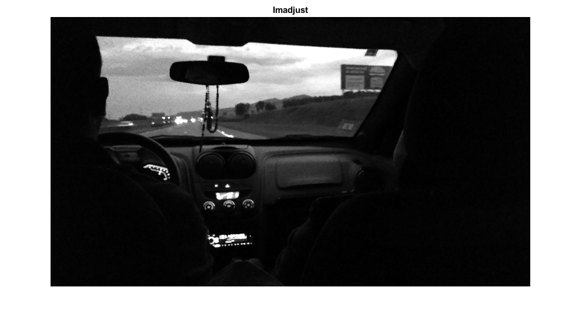

# Image Processing - Image Enhancement

> Small repository for Image Processing
> Coded on third week at Fontys University

Contents
--------

*   [Read GIF Images](#1)
*   [Convert to gray image](#2)
*   [Apply offset and get the difference between the images](#3)
*   [Apply threshold](#4)
*   [Add low contrast image](#5)
*   [Apply imadjust](#6)
*   [Apply imadjust with gamma](#7)
*   [Apply histeq](#8)
*   [Apply adapthisteq](#9)
*   [Comparison](#10)

Read GIF Images
---------------

    [img, map\] = imread( 'week3\\img1.gif', 1);
    [back, map2\] = imread( "week3\\son2.gif", 1);

Convert to gray image
---------------------

    img2 = ind2gray(img, map);
    back2 = ind2gray(back, map2);

Apply offset and get the difference between the images
------------------------------------------------------

    back2 = back2 - 100;
    imgfinal = img2 - back2;

Apply threshold
---------------

    imgfinal2 = imbinarize(imgfinal, 'adaptive', 'ForegroundPolarity','dark','Sensitivity',0.5);
    montage({img2, imgfinal, imgfinal2}, 'Size', \[1 3\]);
    title("Original Image, enhanced image and image with threshold");

Add low contrast image
----------------------

    lowcontrastimg = rgb2gray(imread('week3\\lowContrast.jpg'));
    imshow(lowcontrastimg);
    title("Low Contrast");

Apply imadjust
--------------

    im\_imadjust = imadjust(lowcontrastimg);
    imshow(im\_imadjust);
    title("Imadjust");

Apply imadjust with gamma
-------------------------

    im\_imadjustgamma = imadjust(lowcontrastimg, \[\], \[\], 0.3);
    imshow(im\_imadjustgamma);
    title("Imadjust with gamma correction");

Apply histeq
------------

    im\_histeq = histeq(lowcontrastimg);
    imshow(im\_histeq);
    title("Histeq");

Apply adapthisteq
-----------------

    im\_adapthisteq = adapthisteq(lowcontrastimg);
    imshow(im\_adapthisteq);
    title("Adaptative Histeq");

Comparison
----------

    montage({lowcontrastimg, im\_imadjust, im\_imadjustgamma, im\_histeq, im\_adapthisteq}, 'Size', \[1 5\]);
    title("Original Image and Enhanced Images using imadjust, imadjust with gamma correction, histeq, and adapthisteq")

  
[Published with MATLAB® R2020b](https://www.mathworks.com/products/matlab/)
